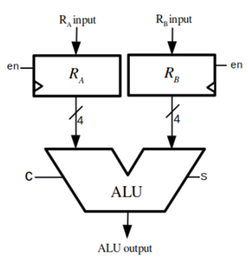
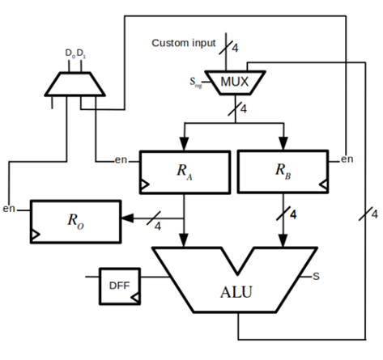
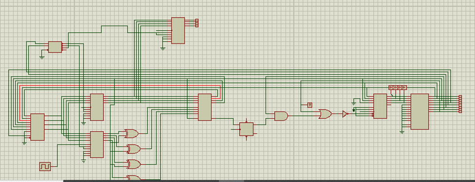

# Simple 4-Bit Microprocessor
**By Waleed Ahmad**

**Professor: Engr Imran Abeel**

## Acknowledgements
I am sincerely thankful to the National University of Science and Technology (NUST) for providing the facilities and environment conducive to my academic pursuits. My gratitude extends to my mentors, Dr. Rehan Ahmad, whose guidance was instrumental in the realization of this project. His expertise and insights have been invaluable. I also express my appreciation to Engr. Imran Abeel for his technical support and mentorship.

## Abstract
This paper provides a comprehensive account of the design and construction of a simple 4-bit microprocessor. The project involved the strategic integration of three key components: the Arithmetic Logic Unit (ALU), Data Registers, and Control Logic. The ALU was developed to perform both addition and 2’s complement subtraction, underpinned by a bespoke combinational logic circuit. Data Registers were implemented to sustain a continuous data flow to the ALU, while the Control Logic was meticulously synchronized with a 4-bit counter and a 2-to-4 decoder to manage signals efficiently. Instruction memory was optimized for both storage and retrieval, forming the backbone of the system which allowed the execution of fundamental programs such as the Fibonacci sequence. This project not only serves as a practical demonstration of the underlying principles of processor operations but also establishes a solid foundation for further exploration in the field of digital logic and microprocessor systems. Through this endeavor, we gained hands-on experience and a deeper understanding of the complexities involved in microprocessor design and functionality.

## Introduction

In this project, I have successfully designed and implemented a simplified 4-bit microprocessor. The design journey began with conceptualizing and then bringing to life a hardware model that operates using logic integrated circuits (ICs). The architecture of this machine is strategically divided into three core components: the Arithmetic Logic Unit (ALU), Data Registers, and Control Logic. Each of these segments plays a pivotal role in the functionality of the microprocessor, allowing it to execute basic arithmetic and logical operations efficiently. This project not only served as a practical application of theoretical concepts but also provided hands-on experience in hardware assembly and programming of a microprocessor system.

## Components (Logic ICs) Used

- 4-bit D-type Registers 
- 4-bit Binary Full Adder 
- 4-bit Binary Counter 
- Quad 2-Data Selectors 
- 2-Line to 4-Line Decoder 
- AND, OR, NOT and XOR Gates 
- Parallel Address, Parallel 8-bit I/O EEPROM

### Specific IC numbers

- 7486 (XOR Gates)
- 74173 x 3 (4 universal register)
- 7474 (D Flip Flop)
- 74139 (2 to 4 decoder)
- 74157 (Quad 2 to 1 MUX)
- 74163 (4 bit up binary counter)
- 7402 (2 input NOR)
- 7408 (2 input AND)
- 7404 × 2 
- 74ls83

## Arithmetic Logic Unit

The Arithmetic Logic Unit (ALU) is the most basic and important part of any computing machine. All the arithmetic or logical operations are performed through it. The ALU used in this project was able to perform binary addition as well as 2’s complement binary subtraction.

## Combinational Logic

The developed circuit seamlessly performs addition or subtraction on pairs of 4-bit numbers and effectively handles carry generation. A selection bit was employed to toggle between the add and subtract operations. The combinatorial circuit was derived from the Boolean logic, formulated as:

Inputs "A" and "B" are processed to produce "Output," with "S" serving as the selection mechanism. Subtraction operations hinged on the inversion of "B" through 1's complement and the elevation of carry-in to achieve 2's complement. The XOR gate's unique properties facilitated the bit inversion process, enabling the system to select between subtraction and pass-through modes.

## Circuit Assembly

The block diagram of ALU and the operations are shown in Figure 1

| Selection Bit (S) | Function    |
|-------------------|-------------|
| 0                 | Out = A + B |
| 1                 | Out = A - B |

**Figure 1 ALU Schematic**

## Data Registers

The constructed machine incorporates two essential 4-bit registers, designated as RA and RB, which serve as the primary data holders for the ALU operations. These registers are interfaced directly with the ALU's input channels, ensuring that RA feeds into input A, and RB feeds into input B. They are designed to be constantly active, continuously delivering data to the ALU, which is a testament to the efficient data flow within the system. The data ingress to RA and RB is governed by an enable bit, which dictates their receptiveness to incoming data, maintaining a high degree of control and precision in the machine's operation.

**Figure 2 Register-ALU Assembly**

## Functionality and Time Synchronization

The project's computing operations commence with initializing the data within the 4-bit registers RA and RB. These registers are designed to perform dual roles: holding initial data and storing the ALU's output. A 4-bit 1-out-of-2 data multiplexer (MUX) facilitates this by selecting between the ALU output and custom input based on the control of a selection bit, Sreg. A D flip-flop is also strategically placed next to the ALU to capture the carry bit, synchronized with the clock's positive edge, allowing for meticulous examination of the ALU's arithmetic operations.

## Output Register

An output register Ro was designated to hold the final result post-computation for user reference, thereby streamlining the process of output retrieval. It is interfaced directly with RA, ensuring a seamless flow of data.

## Register De-multiplexing.

The design now incorporates a de-multiplexing strategy to manage the three signals associated with the registers: enA, enB, and enO. By integrating a 2-to-4 decoder, we effectively condensed these signals, as indicated by the corresponding truth table. This optimization allowed for a more efficient signal distribution, with the decoder outputs directly controlling the enable signals of the registers.

**Figure 3 Design with Decoder Incorporated**

| Input (D0, D1) | Output            |
|----------------|-------------------|
| 00             | RA input enabled  |
| 01             | RB input enabled  |
| 10             | RO input enabled  |
| 11             | no operation      |

## Instruction Memory

The microprocessor’s instruction memory, a matrix of cells capable of storing binary data, has been optimized for storage and retrieval. Each row of the array could be accessed via control signals, allowing for operations like data swapping to be performed efficiently.

## Program Counter

The program counter has been engineered with a 4-bit counter connected to the instruction memory's address line. This setup ensured that upon the arrival of the positive edge of the clock, the next instruction was triggered, showcasing a well-synchronized control flow.

## Instruction Encoding

Instruction memory rows were aligned to an 8-bit configuration to accommodate control signals and custom inputs. The encoding scheme included specific bits for jump operations, carry jumps, and immediate custom inputs, contributing to a robust and versatile instruction set.

| J | C | D1 | D0 | Sreg | S | imm[1] | imm[0] |
|---|---|----|----|------|---|--------|--------|

1. Jump (J): The seventh bit or MSB of the instruction is fixed for Jump. Whenever we set it to 1, the custom input will be loaded in the program counter. 
2. Carry jump (C): The sixth bit is fixed for “jump if ALU operation produces a carry”. Whenever we set it to 1, the custom input will be loaded in the program counter. 
3. Register Address (D1D0): The fifth and fourth bit of instruction is fixed for register address. The values 00, 01, 10 and 11 correspond to RA, RB, RO and no register, respectively. 
4. ALU or Custom input (Sreg): The third bit is reserved for multiplexing ALU or custom input. When it is 0, ALU’s output is directed to registers’ input otherwise, the custom input. 
5. Custom input (immediate): The last three bits, zeroth, first and second are reserved for custom input. Due to adjustment problem, we must compromise custom input length (to 3-bits only). The fourth bit is hard wired to zero (ground), which means, we can only load values ranging from 0 to 7 (either in program counter or registers). 
6. ADD or SUB (S): The second bit of the instruction has dual function. Apart from being part of custom input, it is also connected to ALU selection bit S. This decision is taken based on the observation that when ALU is performing either addition or subtraction, there is no interference of custom input. Similarly, when we are loading some custom input to either registers or counter, we don’t care about ALU processing.

## Programming

There are 9 functions we can perform with this machine. The functions and the set of control signals for them are,

| Function                 | J | C | D1 | D0 | Sreg | S      | imm[1] | imm[0] |
|--------------------------|---|---|----|----|------|--------|--------|--------|
| RA = RA + RB             | 0 | 0 | 0  | 0  | 0    | 0      | 0      | 0      |
| RB = RA + RB             | 0 | 0 | 0  | 1  | 0    | 0      | 0      | 0      |
| RA = RA - RB             | 0 | 0 | 0  | 0  | 0    | 1      | 0      | 0      |
| R0 = RA                  | 0 | 0 | 1  | 0  | 0    | 0      | 0      | 0      |
| RA = imm                 | 0 | 0 | 1  | 0  | 1    | imm[2] | imm[1] | imm[0] |
| RB = imm                 | 0 | 0 | 0  | 1  | 1    | imm[2] | imm[1] | imm[0] |
| Jump to imm if carry out | 0 | 1 | 1  | 1  | 0    | imm[2] | imm[1] | imm[0] |
| Jump to imm              | 1 | 0 | 1  | 1  | 0    | imm[2] | imm[1] | imm[0] |

**Figure 4 4-bit Simple Microprocessor**

## Final Product:

Here we present the final assembly of our simple microprocessor project. The first image is the circuit schematic, detailing the electronic pathways that underpin the processor's operations. The second image is our assembled breadboard, where the schematic has been brought to life with actual components. Together, these images depict the journey from schematic design to a working microprocessor prototype.

**Figure 5 Full Circuit Diagram Schematic**

**Figure 6 Hardware Implementation Snapshot**

## Testing

To validate the functionality of the 4-bit microprocessor, a program was devised to generate the Fibonacci sequence, which is a series of numbers where each number is the sum of the two preceding ones. The following table lists the binary instructions that were fed into the system to conduct this test. This sequence also served as a robust benchmark to assess the computational accuracy and timing synchronization of the processor.

| Steps | Instruction   | Description                        | Binary Code |
|-------|---------------|------------------------------------|-------------|
| 0     | RA = 0        | Load zero to register A            | 00001000    |
| 1     | RB = 1        | Load 1 to register B               | 00011001    |
| 2     | RO = RA       | Push A to output                   | 00100000    |
| 3     | RB = RA + RB  | Add A to B                         | 00010000    |
| 4     | jump if carry | If A+B produce carry jump to start | 01110000    |
| 5     | RA = RA + RB  | Swap A and B                       | 00000000    |
| 6     | RB = RA − RB  | Swap A and B                       | 00010100    |
| 7     | RA = RA − RB  | Swap A and B                       | 00000100    |
| 8     | Jump to 2     | Jump to 3rd instruction            | 10110010    |

## Conclusion

In concluding this project, we've successfully designed and tested a simple microprocessor, illustrating the foundational principles that are at the heart of complex computing devices like laptops and mobile phones. Through tasks such as generating the Fibonacci sequence, we've demonstrated the processor's capabilities and the potential for further expansion and learning. This hands-on experience has bridged theoretical knowledge from digital logic design to practical microprocessor system understanding, laying a solid groundwork for future innovation and exploration in processor design and functionality.

